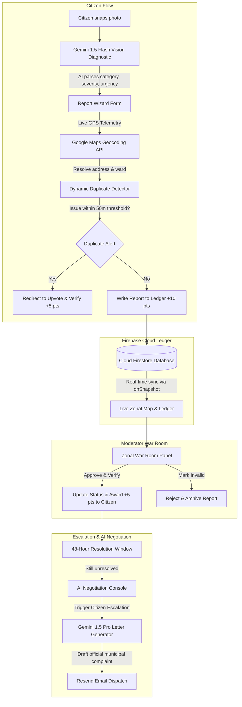

# ⚡ CivicPulse — Hyperlocal municipal redressal ledger & AI negotiation agent

[](https://nextjs.org)
[](https://firebase.google.com)
[](https://ai.google.dev)
[](LICENSE)

CivicPulse is an advanced, decentralized hyperlocal civic ledger and municipal escalation engine designed to empower citizens and streamline ward management. Built for the **Google Hackathon**, the platform leverages the **Google Developer Ecosystem**—specifically **Google Gemini AI**, **Google Maps Platform**, and **Firebase**—to construct a crowd-verified ledger of municipal infrastructure failures and automate civil advocacy.

---

## 🎯 Live Demo
**URL**: [https://community-hero-66083.web.app](https://community-hero-66083.web.app)

| Role | Phone | OTP |
|------|-------|-----|
| 👤 Citizen | 9999999999 | 123456 |
| 🛡️ Moderator | 8888888888 | 123456 |

Or use **Google Sign-In** with any Gmail.

---

## 🗺️ System Architecture & Workflow



---

## 🚀 Deep-Dive Features

### 1. Citizen Portal
- **Multimodal AI Diagnostics (Gemini 1.5 Flash)**: Uploading a picture instantly triggers Gemini Vision to analyze the environment. The AI auto-fills:
  - **Primary Civic Category**: `POTHOLE`, `GARBAGE`, `WATERLOGGING`, `STREETLIGHT`, `SEWAGE`, `CONSTRUCTION`, `TREE`, or `OTHER`.
  - **Diagnostic DNA**: Generates an environmental root-cause hypothesis and estimates the affected population.
  - **Severity Score**: Evaluated on a 1-10 scale to prioritize municipal work order queues.
- **Dynamic 50-Meter Duplicate Filter**: To prevent reporting spam, the platform runs a Haversine distance check against the local Firestore collection. If a similar issue is open nearby, the citizen is redirected to upvote and verify the existing report (earning +5 points) instead of creating a duplicate entry.
- **AI Negotiation Agent & Letter Composer**: If an approved issue languishes unresolved, the citizen has access to the **AI Negotiation Console**. Powered by **Gemini 1.5 Pro**, it ingests the entire ledger record (telemetry, upvotes, severity, history) and crafts a professional, formal complaint letter to municipal zonal heads demanding action.
- **Gamified Reputational Trust Index**: Civic actions update citizen reputation records in Firestore. Submitting valid reports awards +10 points, upvoting/verifying awards +5 points, and resolved issues yield +25 points, unlocking badges like *Civic Pioneer*.

> **[APPLY SCREENSHOT: Dashboard page displaying current user points, active issues list, and ward health map]**
> ``

> **[APPLY SCREENSHOT: Issue reporting page showing snapped photo, address resolved via Google Geocoding, and Gemini AI auto-populated severity and DNA details]**
> ``

> **[APPLY SCREENSHOT: Issue detail page displaying upvote button, WhatsApp-style timeline log, and the AI Negotiation console with the copyable escalation letter]**
> ``

---

### 2. Moderator War Room
- **Live Zonal Control Deck**: Ward moderators view live statistics parsed directly from Firestore, including pending approvals, active incidents, and resolutions completed today.
- **Real-Time Approval Queue**: Issues flow into the moderator's panel in real-time using Firestore `onSnapshot` subscriptions. Moderators can immediately `Approve` (which awards points to the reporter) or `Reject` reports.
- **Spatial Ward Grid**: Uses **Google Maps** to overlay active incidents, allowing moderators to identify zonal clusters (e.g., matching sewer leaks to water main breaks).
- **Shadow Government Performance Grid**: A dashboard grading municipal departments (PWD Roads, Water Board, Sanitation, Municipal Lighting) by calculating their actual resolution rates directly from the community ledger.

> **[APPLY SCREENSHOT: Moderator War Room dashboard showing pending queues, spatial grid map, and department performance indicators]**
> ``

---

## 🛠️ Google Tech Stack Integration

CivicPulse utilizes Google's developer ecosystem to implement a highly performant and secure serverless framework:

### ⚡ Google Gemini API (Primary AI Engine)
- **Multimodal Vision Diagnostics**: Powered by **Gemini 1.5 Flash** to analyze citizen photo uploads (encoded as Base64) and classify municipal issues with high confidence and speed.
- **Context-Aware Synthesis**: Powered by **Gemini 1.5 Pro** to synthesize formal, professional complaint letters by ingesting ledger telemetry and upvote history.

### 🗺️ Google Maps Platform
- **Maps SDK for JavaScript**: Powers interactive vector maps, spatial clustering of incidents, and live ward overlays.
- **Geocoding API**: Reverse-geocodes raw GPS coordinates captured by citizens into human-readable street addresses and ward boundaries.

### 🔥 Firebase & Google Cloud
- **Firebase Authentication**: Implements secure multi-factor Google Sign-In and Phone Authentication with invisible reCAPTCHA.
- **Cloud Firestore**: Real-time serverless NoSQL database that synchronizes the active municipal ledger, user scores, and stats instantly across all clients.

---

## ⚙️ Configuration & Setup

### Environment Configuration
Create a `.env.local` file in the root directory and configure the following environment variables:

```env
# Google Gemini API
GEMINI_API_KEY=your_gemini_api_key_here

# Firebase Configuration
NEXT_PUBLIC_FIREBASE_API_KEY=your_firebase_api_key_here
NEXT_PUBLIC_FIREBASE_AUTH_DOMAIN=your_firebase_project.firebaseapp.com
NEXT_PUBLIC_FIREBASE_PROJECT_ID=your_firebase_project_id
NEXT_PUBLIC_FIREBASE_STORAGE_BUCKET=your_firebase_project.firebasestorage.app
NEXT_PUBLIC_FIREBASE_MESSAGING_SENDER_ID=your_firebase_messaging_sender_id
NEXT_PUBLIC_FIREBASE_APP_ID=your_firebase_app_id
NEXT_PUBLIC_FIREBASE_MEASUREMENT_ID=your_firebase_measurement_id

# Google Maps Platform
NEXT_PUBLIC_GOOGLE_MAPS_API_KEY=your_google_maps_api_key_here
NEXT_PUBLIC_GOOGLE_MAPS_ID=your_maps_style_id_here

# OpenWeather API
OPENWEATHER_API_KEY=your_openweather_api_key_here

# Exa AI (Search & Retrieval)
EXA_API_KEY=your_exa_api_key_here

# NewsData.io API
NEWSDATA_API_KEY=your_newsdata_api_key_here

# Resend Email Service
RESEND_API_KEY=your_resend_api_key_here
RESEND_FROM_EMAIL=onboarding@resend.dev

# Fast2SMS (OTP Verification India)
FAST2SMS_API_KEY=your_fast2sms_api_key_here

# OpenAI (Optional Fallback)
OPENAI_API_KEY=your_openai_api_key_here

# Application Configuration
NEXT_PUBLIC_APP_URL=http://localhost:3000
NEXT_PUBLIC_APP_NAME=CivicPulse
NODE_ENV=development
```

### Installation & Run

1. **Clone the repository and install dependencies:**
   ```bash
   npm install
   ```

2. **Run the development server:**
   ```bash
   npm run dev
   ```

3. **Open the application:**
   Navigate to [http://localhost:3000](http://localhost:3000) in your browser.

---

## 🛡️ License
Licensed under the MIT License.